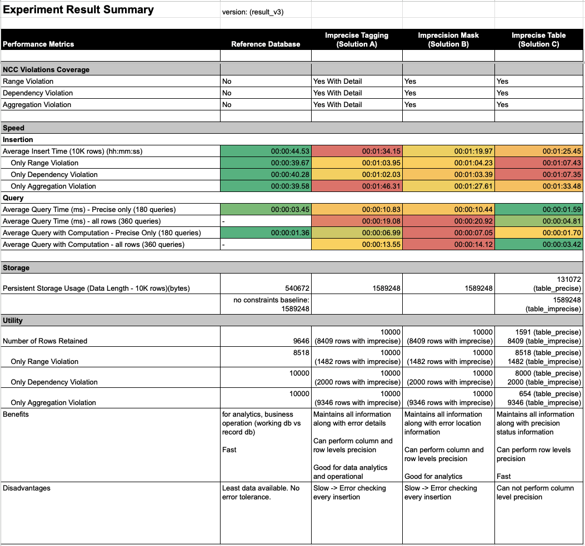

# Theoretical Framework for a Precision-Tolerant Database System

## Overview
This capstone project investigates the conceptual foundations of databases that accommodate data precision variability. It challenges the traditional approach of relational databases that enforce strict adherence to conditional and consistency constraints, which often leads to the rejection of entire data rows upon violation. The project explores an innovative theoretical framework that seeks to retain 'imprecise' data, thereby ensuring robust database operations and enhancing query accuracy without compromising the integrity of the database.

## Credits

This project was made possible through collaborative efforts:
- under the supervision of Dr. Janusz Getta, EIS Faculty, SCIT, University of Wollongong.
- with contributions from the following members: Yonax L, Keny N, Hillary H, Mahmmoud S, and Ricky Z.

## Project Description
Relational databases traditionally enforce data consistency by applying conditional and consistency constraints. When data insertion violates these constraints, it typically results in the rejection of the entire row to maintain database precision. This project proposes an alternative approach that aims to preserve 'imprecise' data while ensuring robust database operations and query accuracy. The envisioned precision-tolerant systems will be implemented as extensions of existing database management systems, focusing on tasks such as data storage, query handling, aggregation, and table merging for data that violates **Numerical Conditional Constraints (NCC)**. By prioritizing data retention, we aim to explore potential benefits such as cost savings in data cleaning and enhanced analytics capabilities, while understanding the associated trade-offs.

## Aims

The primary goal of this project is to design a solution system that is robust to rule violations and capable of retaining maximum information. We aim to provide users with the flexibility to manage single errors within multi-dimensional data records without discarding the entire row's value. Our approach does not seek to correct errors or predict correct values but rather to offer users the discretion to handle imprecise data.

## Scope

This project will specifically focus on data processing for storage and query handling related to Numerical Conditional Constraints (NCC).

## Built with

## Method

Our research will utilize a case study approach to assess the proposed solutions. This involves an in-depth examination and analysis of a specific case or a small number of cases within a particular context.

We will use a sample case study with NCC violations to test our solutions. The database reproduction is derived from a ride-hailing or online taxi scenario, where daily trip payment information is stored in a database table named `Payment`. The columns in the `Payment` table are as follows:

- `trip_id`: Unique identifier for each data row, serving as the primary key.
- `driver_id`: Unique identifier for the driver, assumed to be a foreign key from the `Driver` table.
- `Basefare`: Numerical column for the base service charge.
- `Surcharge`: Numerical column for additional surcharges to the basefare.
- `Total`: Numerical column for the total amount charged, calculated by adding basefare and surcharge.
- `Duration`: Numerical column for the trip duration in hours, accounting for drivers' work hours.

## Nummerical Conditional Constraints
The sample database will address three main NCC violations across four numerical columns (`Basefare`, `Surcharge`, `Total`, `Duration`), with a current focus on three types of violations, including one typically managed with table constraints and two categorized as Numeric Functional Dependency (NFD).

- 
- 
- 

## Solutions
### Solution A: Imprecise Tagging Method
The first method is to perform tagging on the numerical violations using two additional columns. The first column, called ”imprecise status,” uses a binary value to tell us if there is any violations within each row. 
- 
- 

### Solution B: Precision Mapping Method
In the given dataset, there are multiple columns, each con- taining numerical values. Accompanying these data columns are corresponding imprecise_mapping columns, which are uniquely named based on the original data column labels. These imprecise_mapping columns are used to identify instances of rule violations within the dataset, akin to boolean masking.
- 
- 

### Solution C: Imprecise Table Method
The third method is to separate the imprecise data and store them in a imprecise table from the the original table. In this method, two tables are employed: one to store impre- cise data and another to store precise data.
- 
- 
## SQL Scripts for Data Experiment

### Overview

The repository includes a series of SQL scripts for conducting the experiment and handling various types of data violations:

- `main.sql`: Script detailing the step-by-step process of the experiment.
- Insertion scripts for 10K rows of data with different types of violations.
- Non-computational and computational query scripts for precise and imprecise data handling.

## Scripts Description

#### Experiment Process
- `main.sql`: Describes the step-by-step process of the entire experiment.

### Data Insertion Scripts
<!-- - **All Types of Violations (10K rows each)**
  - `Insert BaselineAll.sql`
  - `Insert A/B/C ScriptAll.sql`

- **Range Violation (10K rows each)**
  - `Insert Baseline Script Range.sql`
  - `Insert A/B/C Script Range.sql`

- **Dependency Violation (10K rows each)**
  - `Insert Baseline Script Dependency.sql`
  - `Insert A/B/C Script Dependency.sql`

- **Aggregation Violation (10K rows each)**
  - `Insert Baseline ScriptAgg.sql`
  - `Insert A/B/C ScriptAgg.sql` -->

 <table style="border:1px solid black; border-collapse: collapse;">
  <tr>
    <th style="border:1px solid black;">Violation Type</th>
    <th style="border:1px solid black;">Scripts</th>
  </tr>
  <tr>
    <td style="border:1px solid black;">All Types (10K rows each)</td>
    <td style="border:1px solid black;">
      Insert BaselineAll.sql 
      Insert A ScriptAll.sql 
      Insert B ScriptAll.sql 
      Insert C ScriptAll.sql
    </td>
  </tr>
  <tr>
    <td style="border:1px solid black;">Range Violation (10K rows each)</td>
    <td style="border:1px solid black;">
      Insert Baseline Script Range.sql 
      Insert A Script Range.sql 
      Insert B Script Range.sql 
      Insert C Script Range.sql
    </td>
  </tr>
  <tr>
    <td style="border:1px solid black;">Dependency Violation (10K rows each)</td>
    <td style="border:1px solid black;">
      Insert Baseline Script Dependency.sql 
      Insert A Script Dependency.sql 
      Insert B Script Dependency.sql 
      Insert C Script Dependency.sql
    </td>
  </tr>
  <tr>
    <td style="border:1px solid black;">Aggregation Violation (10K rows each)</td>
    <td style="border:1px solid black;">
      Insert Baseline ScriptAgg.sql 
      Insert A ScriptAgg.sql 
      Insert B ScriptAgg.sql 
      Insert C ScriptAgg.sql
    </td>
  </tr>
</table>

### Query Execution Scripts
<!-- - **Non-computational Queries**
  - Precise Queries:
    - `baseline precise.sql`
    - `A1/B1/C1 precise.sql`
  - Precise + Imprecise Queries:
    - `A1/B1/C1A1 all.sql`

- **Computational Queries**
  - Precise Queries:
    - `baseline computational.sql`
    - `A2/B2/C2 precise.sql`
    
  - Precise + Imprecise Queries:
    - `A2/B2/C2 all.sql` -->

<table style="border: 1px solid black; border-collapse: collapse;">
  <tr>
    <th style="border: 1px solid black;">Query Type</th>
    <th style="border: 1px solid black;">Precise Queries</th>
    <th style="border: 1px solid black;">Precise + Imprecise Queries</th>
  </tr>
  <tr>
    <td style="border: 1px solid black;">Non-computational Queries</td>
    <td style="border: 1px solid black;">
      baseline precise.sql 
      A1 precise.sql 
      B1 precise.sql 
      C1 precise.sql
    </td>
    <td style="border: 1px solid black;">
      A1 all.sql 
      B1 all.sql 
      C1 all.sql
    </td>
  </tr>
  <tr>
    <td style="border: 1px solid black;">Computational Queries</td>
    <td style="border: 1px solid black;">
      baseline computational.sql 
      A2 precise.sql 
      B2 precise.sql 
      C2 precise.sql
    </td>
    <td style="border: 1px solid black;">
      A2 all.sql 
      B2 all.sql 
      C2 all.sql
    </td>
  </tr>
</table>

### Performance

## Conclusion
- This project introduces three solutions that allow for the retention of imprecise data, albeit with some observed compromises in certain metrics. Moreover, each solution presents its own set of pros and cons, contingent upon its specific design.
- From our experiment, the Imprecise Tagging Method (Solution A) emerges as the most optimal choice due to its multiple precision level and detailed violation information capability. Alternatively, if prioritizing speed is critical, the Imprecise Table method (Solution C) can be implemented, albeit at the expense of precision level capability. Lastly, while the Precision Mapping Method (Solution B) yields outcomes akin to Solution A in MySQL, it may have potential benefit for systems designed for efficient matrix computation. In conclusion, we affirm that operating with imprecise data is feasible, and robust performance can be achieved even in the presence of such data.
- From our study, we studied the potential benefits and ap-plications of these precision tolerant database systems in record management, operational database, data analytics and even forensics. Considering the trade offs, substantial benefits may arise from richer dataset, lower maintenance expense and availability of violation details. As a disclaimer, our solutions are tested to handle NCC through a single case study. It is by no means exhaustive within the NCC domain, let alone all types of violations. However, we conclude that the general design can serve as a good baseline to building more comprehensive solutions.

## Restriction
This project is part of my capstone project at UoW. The code is provided for educational purposes and demonstration use only. 

## Disclaimer
This code is provided "as is" without warranty of any kind, and I, as one of the authors, am not liable for any issues that arise from its use. While you are welcome to learn from it, please do not copy or distribute it for your own coursework or assignments without permission.

